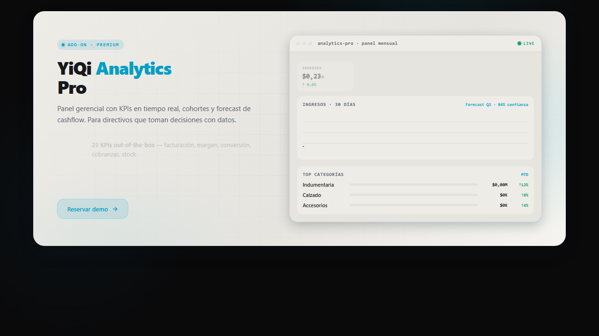

# Analytics Pro banner template

Use this template when the website needs the canonical Analytics Pro promotional
banner from the DS catalog.



## Files

| File | Purpose |
|------|---------|
| `html/analytics-pro-banner.html` | Minimal host page that references the canonical component. |

## Dependencies

This component is published from this repository. Reference it instead of
copying the JavaScript or its injected styles:

```html
<link rel="stylesheet" href="https://diguardia.github.io/yiqi-imagen/styles.css">
<script src="https://diguardia.github.io/yiqi-imagen/components/analytics-pro-banner.js" defer></script>
```

## Adapt

- Set `base` to the path where the DS assets are served.
- Set `preview` only when the consuming project has a real preview page.
