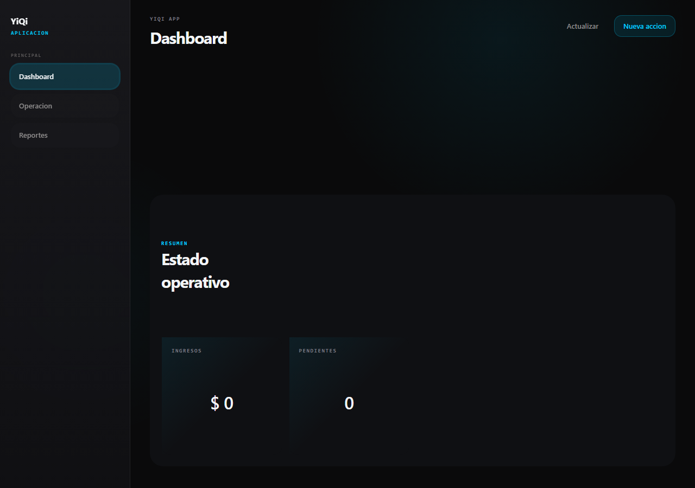

# App shell template

Use this template when a YiQi app needs the canonical sidebar, topbar, and
content layout.



## Files

| File | Purpose |
|------|---------|
| `html/app-shell.html` | Copy/paste HTML structure using canonical DS classes. |

## Style dependency

Do not copy CSS. Load the canonical stylesheet:

```html
<link rel="stylesheet" href="https://diguardia.github.io/yiqi-imagen/styles.css">
```

## Adapt

- Replace product name and navigation labels.
- Wire active navigation state in the consuming app.
- Replace example KPI cards and content panels with project content.
- Keep `app-shell`, `sidebar`, `topbar`, `content`, `nav-item`, `btn`, and
  `btn-primary` class names.
