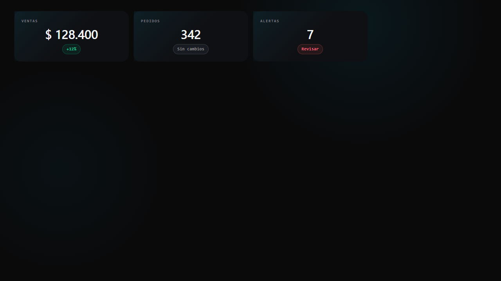

# KPI card template

Use this template when a project needs canonical YiQi KPI cards.

## Files

| File | Purpose |
|------|---------|
| `html/kpi-card.html` | Copy/paste KPI card examples using canonical DS classes. |

## Style dependency

Load `https://diguardia.github.io/yiqi-imagen/styles.css` and keep the classes
from the template. Do not copy the full stylesheet.

## Adapt

- Replace values and labels.
- Add source/tooltips in the consuming project when the KPI is real.
- Use unavailable/demo states when the source is not validated.
