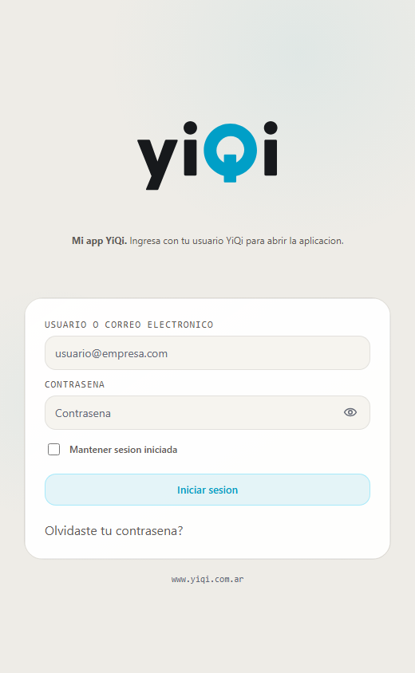

# YiQi login template for Next.js

Reusable login screen extracted from a real YiQi app and generalized for future
projects. It keeps the approved visual structure while making app-specific text
and submit behavior configurable.

Agent rule: copy/paste this template as the first implementation path for a
Next.js YiQi login. Adapt project copy, redirect, storage key, and `onSubmit`
integration, but do not rebuild the layout from scratch unless the project has a
documented reason to diverge.

## Preview

Desktop, light theme:


Narrow viewport, light theme:



## What this includes

| File | Purpose |
|------|---------|
| `yiqi-login-template.tsx` | Client React component for the login form and states. |
| `yiqi-login-template.css` | Adapter-only CSS for behavior not yet covered by `styles.css`. |
| `yiqi-logo-animated.tsx` | Inline animated YiQi logo. No image asset required. |
| `preview.html` | Static preview used for visual QA. |
| `assets/login-template-preview.png` | Desktop light-theme screenshot. |
| `assets/login-template-preview-mobile.png` | Narrow viewport light-theme screenshot. |

## When to use

- A Next.js app needs a YiQi login screen.
- The project wants the standard centered card, animated logo, status slot, and
  remember-user behavior.
- The app has its own backend or proxy for authentication.

## When not to use

- The project already has a custom auth provider and only needs minor styling.
- The screen is not a YiQi login.
- The project cannot use React client components.

## Install

Copy these files into your project, for example:

```text
components/auth/yiqi-login-template.tsx
components/auth/yiqi-logo-animated.tsx
styles/yiqi-login-template.css
```

Load the canonical YiQi stylesheet once from `app/layout.tsx` or your document
head. Do not copy `styles.css` into the project:

```tsx
<link rel="stylesheet" href="https://diguardia.github.io/yiqi-imagen/styles.css" />
```

Import only the small adapter CSS from your app layout or global CSS entry:

```tsx
import '@/styles/yiqi-login-template.css'
```

Use the component in `app/page.tsx` or your login route:

```tsx
'use client'

import { useRouter } from 'next/navigation'
import { YiQiLoginTemplate } from '@/components/auth/yiqi-login-template'

export default function LoginPage() {
  const router = useRouter()

  return (
    <YiQiLoginTemplate
      appName="Mi app YiQi"
      description="Ingresa con tu usuario YiQi para abrir la aplicacion."
      onSubmit={async ({ username, password }) => {
        const response = await fetch('/api/auth/login', {
          method: 'POST',
          headers: { 'Content-Type': 'application/json' },
          body: JSON.stringify({ username, password }),
        })

        if (!response.ok) {
          return { error: 'No pudimos iniciar sesion. Revisa tus datos.' }
        }

        router.replace('/home')
        return { ok: true }
      }}
    />
  )
}
```

## Project-specific text

Change these props per project:

- `appName`
- `description`
- `forgotPasswordMessage`
- `rememberStorageKey`
- redirect logic inside `onSubmit`

The template should not mention a specific module such as pedidos, facturas, or
compras unless the project passes that copy explicitly.

## Security rules

- Never store passwords, tokens, refresh tokens, or API keys in `localStorage`.
- The remember-user option stores only the username.
- Run authentication through a backend or internal Next.js route when possible.
- User-facing errors must stay functional and avoid technical details.

## Visual QA

The previews were generated from `preview.html` with the same CSS classes used
by the template. The preview loads `../../styles.css`, matching the same
canonical stylesheet that projects should consume from the published URL.

- Desktop: 1280 x 900, light theme.
- Narrow viewport: 520 x 844, light theme.

Re-run visual QA after changing layout, spacing, logo, colors, breakpoints, or
state rendering.
