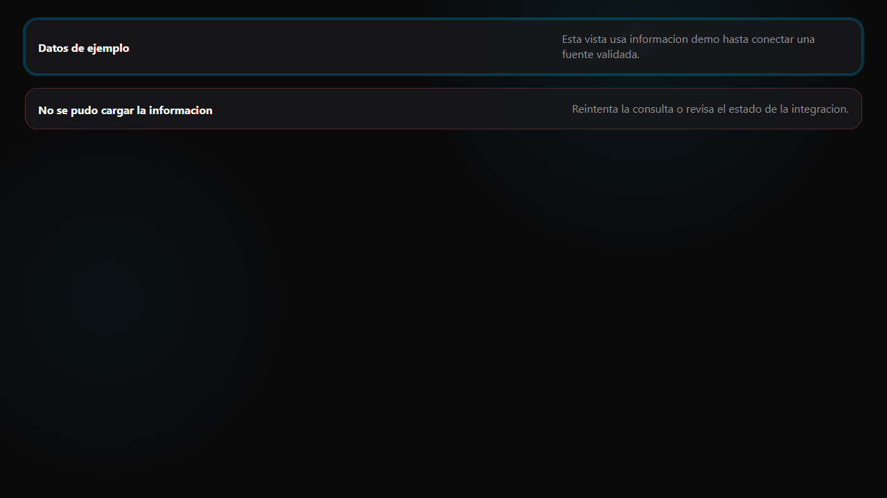

# Runtime banner template

Use this template when a project needs to show mock, unavailable, or error
runtime state without pretending that data is real.

## Files

| File | Purpose |
|------|---------|
| `html/runtime-banner.html` | Copy/paste runtime state banners using DS classes. |

## Style dependency

Load `https://diguardia.github.io/yiqi-imagen/styles.css`. Do not copy the full
stylesheet.
